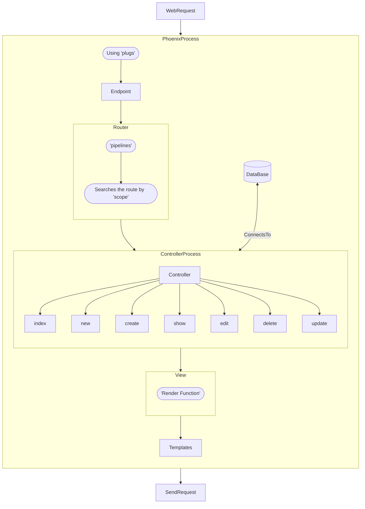

# Elixir

`spawn(<function>)` → runs the function asynchronously.

scope of anonymous functions, variables after the function can be accessed (closures). AVOID

Parenthesis can be omitted when calling named functions:

`IO.puts("with parens")` `IO.puts "no parens"`

Modules: `Module.<function>(parameters)` They use CamelCase and module’s filenames use snake_case.

Function arities → number of arguments a function receives.

[Capture operator](https://stackoverflow.com/questions/44266193/why-do-we-need-a-function-capture-operator-in-elixir)

Creating an anonymous function: 

```elixir
iex(5)> mult = &(&1 * &2)
> &:erlang.*/2
iex(6)> mult.(10,5)
> 50
```

Control Flow with Functions:

```elixir
defmodule Compare do
  def greater(left, right) do
    check(left >= right, left, right)
  end

  defp check(true, left, _), do: left
  defp check(false, _, right), do: right
end
```

Elixir’s compiler needs the `require` directive to use the module in the compilation phase when using macros.

Tail Recursive Functions → limits the amount of memory used (sometimes the memory usage is excessive if recursion is used).

Some recursive functions don’t have boundaries. “Timers” or “Max_depth” can be used, max_depth stands for the amount of recursive function.

An anonymous recursive function can be created with a named function and the `&` (capture operator) to capture de function’s reference.

Comprehensions:

```elixir
iex(32)> for x <- ["a", "b", "c"], do: String.upcase(x)
> ["A", "B", "C"]
```

Elixir has Structs and Polymorphic functions with “Protocols”.

Erlang’s Dialyzer tool → analyzes code →  “dialyxir” module for Elixir

- Key Aspects of elixir:
    - Persistent Data Structures → Immutability
    - Preemptive scheduler
    - Testing: properties to test for your code and writing good generators for the data over which you want to test.
- [Enum Cheatsheet](https://hexdocs.pm/elixir/1.16/enum-cheat.html)

# Phoenix

[Phoenix in Action Repo w v1.7.10](https://github.com/fborello-lambda/phoenix_in_action)

[Phoenix LiveView simple project](https://fly.io/phoenix-files/dynamic-forms-with-streams/)

[Phoenix Playlist](https://youtube.com/playlist?list=PL2Rv8vpZJz4zM3Go3X-dda478p-6xrmEl&feature=shared) → Useful 

[Phoenix in Action comments](https://elixirforum.com/t/phoenix-in-action-book-running-the-code-in-2023/55828)

Set up Postgres docker container:

```bash
docker run \
	--name phx_db \
	-e POSTGRES_USER=phx_db \
	-e POSTGRES_PASSWORD=phx_test \
	-p 5432:5432 \
	-d postgres 
```

Inside `/phx_app/config/dev.exs`  if using a standalone phx-app change:

```elixir
# Configure your database
config :demo, Demo.Repo,
  username: "phx_db",   #POSTGRES_USER
  password: "phx_test", #POSTGRES_PASSWORD
  hostname: "localhost",
  database: "demo_dev",
  stacktrace: true,
  show_sensitive_data_on_connection_error: true,
  pool_size: 10
```

(Only used when developing). Now `mix ecto.create` can be used to create de Postgres database.


## Phoenix Structure // How it works?



If the the Phoenix App is named `demo` → `demo_web` is the dir in which all the components, controllers, and routes are specified.

```
/demo/lib
├── demo
│   ├── application.ex
│   ├── mailer.ex
│   └── repo.ex
├── demo.ex
├── demo_web
│   ├── components
│   ├── controllers
│   ├── endpoint.ex
│   ├── gettext.ex
│   ├── router.ex
│   └── telemetry.ex
└── demo_web.ex
```

`pipelines` group `plugs`

If a scope is defined in`router.ex`, such as the following one:

```elixir
#[...]
scope "/demo", DemoWeb do
    pipe_through(:browser)

    get("/", TestController, :index)
  end
#[...]
```

means that the route “/demo” will “open” the `TestController` controller defined inside `/demo_web/controllers`. Now, following the guidelines another module to specify the path to the html files should be created `/demo_web/controllers/test_html.ex` inside it: 

```elixir
defmodule AuctionWeb.TestHTML do
  use AuctionWeb, :html

  embed_templates "test_html/*"
end
```

The `embed_templates` function is trying to bind the htmls inside the path `/demo_web/controllers/test_html` to the controller. The `html.heex` templates have to be placed in that dir. 

# Phoenix in Action

Phoenix in action chapter6 → `{Phoenix.PubSub, name: AuctionWeb.PubSub}` above`AuctionWeb.Endpoint,` in `<umbrella>/apps/auction_web/lib/auction_web/application.ex` . This handles the pubsub error. 

[Phoenix 1.7.x Routing](https://hexdocs.pm/phoenix/routing.html) → Useful, links can be done like this:

```elixir
<%= for item <- @items do %>
    <li>
      <strong class="bg-brand/5 text-[0.8125rem] ml-3 rounded-full px-2 font-medium leading-6 text-orange-400	">
        <.link href={~p"/items/#{item.id}"}><%= item.title %></.link>
      </strong>
      - <%= item.description %>
    </li>
<% end %>
```

`/items` is the route specified inside `router.ex`

```elixir
scope "/", AuctionWeb do
    pipe_through :browser

    get "/", PageController, :home
    resources "/items", ItemController, only: [:index, :show, :create, :new]
  end
```

And  `controllers/item_controller.ex`

```elixir
defmodule AuctionWeb.ItemController do
  use AuctionWeb, :controller

  def index(conn, _params) do
    # The home page is often custom made,
    # so skip the default app layout.
    render(conn, :test, layout: false)
  end

  def show(conn, %{"id" => id}) do
    # The home page is often custom made,
    # so skip the default app layout.
    item = Auction.get_item(id)
    render(conn, :show, item: items, layout: false)
  end
end
```

And the views are defined inside `controllers/item_html.ex`

```elixir
defmodule AuctionWeb.ItemHTML do
  use AuctionWeb, :html

  embed_templates "item_html/*"
end
```

The controller calls the function render/3 with the Plug.conn, the html template specified as an atom. `:test` → refers to →`item_html/test.html.heex`. A variable can be passed to the template, for example, the function `show()` calls `render(conn, :show, item: items).` , now the variable “item” can be accessed inside the template == `:show` == `show.html.heex` as follows: `@items`. The first line  showing how to code links,`<%= for item <- @items do %>`, demonstrates how to use the variable passes to the template.

## Creating a form

I’m going to call the “controller” the `controller/items_controller.ex` file and the “view” will be the `page_html/:atom.html.heex"` . Using LiveView is maybe easier and gives you more possibilities, but if only HTML is wanted we can do the following, according to Phoenix’s Docs:

[Phoenix Docs](https://hexdocs.pm/phoenix_live_view/Phoenix.Component.html#form/1-example-outside-liveview-regular-http-requests)

Inside the view:

```elixir
# [...]
<.form for={@form} action={~p"/items"}>
  <.input field={@form[:title]} />
	<.input
    type="datetime-local"
    value="2024-01-24T19:30"
    min="2024-01-24T00:00"
    max="2024-06-24T00:00"
    field={@form[:ends_at]}
  /> # <- input datetime with calendar gui
	<button>Save</button>
</.form>
# [...]
```

Inside the controller:

```elixir
# [...]
use AuctionWeb, :live_view # important, makes the function "to_form()" usable

def new(conn, _params) do
	item = Auction.new_item()
	render(conn, :new, form: to_form(item), layout: false)
end
# [...]
```

And `Auction.new_item()` returns an `Ecto.Changeset`:

```elixir
# [...]
import Ecto.Changeset

  def changeset(item, params \\ %{}) do
    item
    |> cast(params, [:title, :description, :ends_at])
    |> validate_required(:title)
    |> validate_length(:title, min: 3, max: 200)
    |> validate_length(:description, min: 3, max: 200)
    |> validate_change(:ends_at, &validate_date/2)
  end
# [...]
```

Take into account that `\items` should have “RESTful” routes, those where defined inside `router.ex`:

```elixir
# [...]
resources "/items", ItemController, only: [:index, :show, :create, :new]
# [...]
```

## Easy redirection

[Phoenix Docs](https://hexdocs.pm/phoenix/controllers.html#redirection)

If a form has been created, the controller will be “using” the module `:liveview` and `:controller`, to specify the `redirect` function from the controller module the following can be done:

```elixir
# [...]
def show(conn, %{"id" => id}) do
    item = Auction.get_item(id)
    render(conn, :show, item: item, layout: false)
  end

  def new(conn, _params) do
    item = Auction.new_item()
    render(conn, :new, form: to_form(item), layout: false)
  end

  def create(conn, %{"item" => item_params}) do
    {:ok, item} = Auction.insert_item(item_params)
    Phoenix.Controller.redirect(conn, to: ~p"/items/#{item.id}") # <- Redirection
  end
# [...]
```

The “sigil”p == ~p makes this task easy. Here, in this module, we have the route `items/new` which “triggers” the `new()`  function, whose view has the form previously defined, the form redirects to `~p"/items"` with a POST request, this triggers the `create()` function. Finally, a redirection is performed to `~p"/items/#{item.id}"`, this route triggers the `show()` function. All this “operation” is possible because RESTful paths are defined in `router.ex`.

## Handle Errors with the case statement

This expression is really useful. If the insertion is made without errors, based on the Ecto.Changeset, it redirects to the `show()` function, else it redirects again to the `new()` function. 

```elixir
def create(conn, %{"item" => item_params}) do
  case Auction.insert_item(item_params) do
    {:ok, item} -> Phoenix.Controller.redirect(conn, to: ~p"/items/#{item.id}")
    {:error, item} 
								-> 
		conn
        |> Phoenix.Controller.put_flash(:error, "Try again") # <- inserts a flash msg
        |> Phoenix.Controller.redirect(to: ~p"/items/new")
  end
 end
```

Inside the view:

[Phoenix Docs](https://hexdocs.pm/phoenix/controllers.html#flash-messages)

```elixir
#[...]
<.flash_group flash={@flash} />
#[...]
```

## How to edit? Similar to new and create but with edit and update

→ Note: `Auction.edit_item()` has to be defined in the non-web app:

```elixir
def edit_item(id) do
  get_item(id)
  |> Item.changeset()
end
```

Create a new html → `edit.html.heex` (the view) and copy to it the `new.html.heex` contents. Now, inside the controller:

```elixir
def edit(conn, %{"id" => id}) do
    item = Auction.edit_item(id)
    render(conn, :edit, form: to_form(item), id: id, layout: false) # <- the id is passed
  end

  def update(conn, %{"id" => id, "item" => item_params}) do
    item = Auction.get_item(id)

    case Auction.update_item(item, item_params) do
      {:ok, item} ->
        Phoenix.Controller.redirect(conn, to: ~p"/items/#{item.id}")

      {:error, item} ->
        conn
        |> Phoenix.Controller.put_flash(:error, "Try again")
        |> Phoenix.Controller.redirect(to: ~p"/items/edit/#{item.id}")
    end
  end
```

Look, the id is passed to the view, inside the view the following can be done:

```elixir
<.form for={@form} action={~p"/items/#{@id}"} method="put"> # <- only this line is modified
																														# compared to new.html.heex
	<.input type="text" field={@form[:title]} />
	<.input type="text" field={@form[:description]} />
	<.input
	  type="datetime-local"
	  value="2024-01-24T19:30"
	  min="2024-01-24T00:00"
	  max="2024-06-24T00:00"
	  field={@form[:ends_at]}
/>
```

Phoenix seems smart enough to detect that the form was generated with an “edit” trigger, so the form will generate automatically a PUT response, but it can be explicitly defined with the “method” keyword.

## Phoenix in Action Summary of chapter 9

### Good workflow

- Add the routes
- Create the Controller and Add the functions
- Create the html template (Views)

### Recap

- A RESTful resource contains actions for `index`, `show`, `new`, `create`, `edit`, `update` and `delete`.
- Each controller accepts two parameters, a Plug.Conn struct and the parameters from the user request.

→ Note: Ecto.Schema virtual field for non-hashed passwords. Multiple changesets help to provide more security limiting the access to the password.

→ Plugs are powerful to handle sessions.

### Chapter 10

I couldn’t make it work the following:  `delete "/logout", SessionController, :delete.`. I changed it to handle “GET” requests, which are triggered with a simple form with a button, whose action is `"login"`

### Chapter 11

Define global functions embedded in the htmls, inside `auction_web/lib/auction_web.ex`:

```elixir
defp html_helpers do
  quote do
		#[...]
    import AuctionWeb.GlobalHelpers
  end
end
```

And the module `AuctionWeb.GlobalHelpers` can be defined inside a file named `auction_web/lib/global_helpers.ex`. The functions defined inside the module can be accesed directly inside the html.

```elixir
<%= "#{integer_to_currency(bid.amount)}" %>
```

In the example above, `integer_to_currency()` is a function from the `GlobalHelpers` module.

# Code an API on top of the HTML web_app

[Phoenix Docs](https://hexdocs.pm/phoenix/json_and_apis.html#rendering-json)

Create a new folder named api and add the following files → `/controllers/api/item_controller.ex` and `/controllers/api/item_json.ex`

Inside `item_controller.ex`:

```elixir
defmodule AuctionWeb.Api.ItemController do
  use AuctionWeb, :controller

  def index(conn, _params) do
    items = Auction.list_items()
    render(conn, :index, items: items)
  end
end
```

Inside `item_json.ex`:

```elixir
defmodule AuctionWeb.Api.ItemJSON do
  alias Auction.Item

  def index(%{items: items}) do
    %{data: for(item <- items, do: data(item))}
  end

  defp data(%Item{} = item) do
    %{
      id: item.id,
      title: item.title,
      descr: item.description,
      ends_at: item.ends_at
    }
  end
end
```

The index function inside the `item_json.ex` is called by the controller automatically whenever the render function is called with the `:index` atom.

Finally, in `router.ex` uncomment the ”/api” scope and add the following:

```elixir
scope "/api", AuctionWeb do
  pipe_through :api

  resources "/items", Api.ItemController, only: [:index, :show]
end
```
